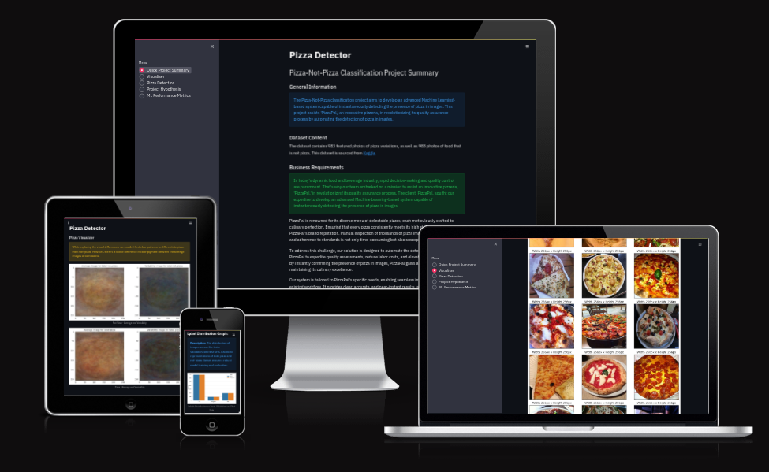
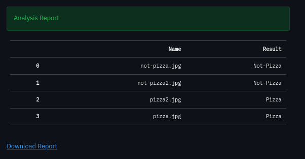

## Table of Contents
1. [Dataset Content](#dataset-content)
2. [Business Requirements](#business-requirements)
3. [Hypothesis and validation](#hypothesis-and-validation)
4. [Rationale for the model](#the-rationale-for-the-model)
5. [Implementation of the Business Requirements](#the-rationale-for-mapping-business-requirements-to-data-visualizations-and-ml-tasks)
6. [ML Business case](#ml-business-case)
7. [Dashboard design](#dashboard-design-streamlit-app-user-interface)
8. [CRISP-DM Process](#crisp-dm-process-implementation)
9. [Bugs](#bugs)
10. [Deployment](#deployment)
11. [Technologies used](#technologies-used)
12. [Credits](#credits)

 

### Live Pizza Predictor can be found [here](https://pizza-detector-0540d49673e2.herokuapp.com/)

 

## Dataset Content

The dataset contains 983 featured photos of pizza variations, as well as 983 photos of food that is not pizza. This client is particularly concerned about identifying pizza as it is their flagship product. The dataset is sourced from [Kaggle](https://www.kaggle.com/datasets/carlosrunner/pizza-not-pizza).

See Image

 

---

[Back to top](#table-of-contents)

 

## Business Requirements

In today's dynamic food and beverage industry, rapid decision-making and quality control are paramount. That's why our team embarked on a mission to assist an innovative pizzeria, "PizzaPal," in revolutionizing its quality assurance process. The client, PizzaPal, sought our expertise to develop an advanced Machine Learning-based system capable of instantaneously detecting the presence of pizza in images.

PizzaPal is renowned for its diverse menu of delectable pizzas, each meticulously crafted to culinary perfection. Ensuring that every pizza consistently meets its high standards is central to PizzaPal's brand reputation. Manual inspection of thousands of pizza images to confirm quality and adherence to standards is not only time-consuming but also susceptible to human error.

To address this challenge, our solution is designed to automate the detection process, enabling PizzaPal to expedite quality assessments, reduce labor costs, and elevate customer satisfaction. By instantly confirming the presence of pizza in images, PizzaPal gains a competitive edge in maintaining its culinary excellence.

Our system is tailored to PizzaPal's specific needs, enabling seamless integration into their existing workflow. It provides clear, accurate, and near-instant results, allowing PizzaPal's quality control team to focus their expertise on the finer aspects of pizza perfection.

In this school project, we take inspiration from the real-world need faced by PizzaPal, an imaginary but forward-thinking business customer. Our objective is to demonstrate how Machine Learning can empower the food and beverage industry by automating image classification, enhancing quality control, and reducing operational inefficiencies.

Join us on this journey as we explore the capabilities of Machine Learning to transform the way businesses, like our visionary client PizzaPal, maintain their commitment to excellence in the world of food and beverage. Discover how cutting-edge technology can optimize operations, improve product quality, and drive success in a competitive industry.

Business Requirements for Pizza vs. Not-Pizza Image Classification System:

1. **Automated Pizza Detection:** The system must automate the process of classifying images as either containing pizza or not-pizza. This automation should significantly reduce the time and effort required for manual image inspection.

2. **Prediction Accuracy:** The client requires a reliable system capable of achieving high accuracy in classifying pizza and not-pizza images. The minimum acceptable accuracy should be defined based on the specific needs of the client.

3. **Scalability:** The system should be scalable to handle a large number of images, reflecting the client's potential expansion of operations. It should efficiently process and classify images in real-time.

4. **User-Friendly Interface:** The client expects an easy-to-use interface for uploading images and receiving classification results. The system should be intuitive for users with minimal technical expertise.

5. **Prediction Reporting:** The system should provide prediction reports for each examined image, indicating the classification (pizza or not-pizza) and the associated confidence level or probability.

6. **Fast Processing:** The client requires a system capable of processing images quickly and providing near-instantaneous results. This speed is essential for streamlining decision-making processes.

7. **Continuous Improvement:** The system should support continuous improvement and model retraining to adapt to changes in image data patterns and to maintain high prediction accuracy.

---

[Back to top](#table-of-contents)

 

## Hypothesis and validation

1. **Hypothesis** (Pizza Detection Features): Pizza presence can be accurately identified by analyzing the shape and toppings within images.
   - __Validation__: To validate this hypothesis, we will gather a dataset of pizza images with various shapes and toppings. We will conduct a detailed analysis, including feature extraction and shape recognition. The validation process will involve developing a feature extraction pipeline to capture key pizza characteristics, such as circular shape and the presence of toppings. We will then build an average image study to examine common patterns in pizza images, emphasizing shape and topping distribution.

2. **Hypothesis** (Model Configurations): Exploring different model configurations will lead to improved accuracy in pizza detection.
   - __Validation__: Perform a comprehensive exploration of various model configurations. We will experiment with different network architectures, layers, activation functions, and hyperparameters. For each configuration, we will conduct extensive training and evaluation, keeping the dataset and other factors consistent. We will compare the accuracy and performance metrics of each model to determine which configurations lead to improved pizza detection accuracy.

3. **Hypothesis** (System Efficiency and Response): The Project's Success Relies on Accurate Pizza Detection and Efficient System Response.  
   - __Validation__: Assess system's real-time processing and scalability for efficient image classifications.

 

### Hypothesis 1
> Pizza presence can be accurately identified by analyzing the shape and toppings within images.

 

**1. Introduction**

We hypothesize that pizzas exhibit distinctive characteristics that can be leveraged for accurate identification. One of the primary identifiers is the circular, flat shape of pizzas, typically accompanied by a variety of toppings encapsulated within the circular mass. To harness this inherent property in the context of machine learning, we need to preprocess the images to ensure optimal feature extraction and model training.

When working with an image dataset, the crucial step of normalizing the images before training a neural network serves two fundamental purposes:

1. **Consistent Results**: Normalization ensures that the trained neural network produces reliable and consistent predictions when faced with new test images. This consistency is vital for the model's generalization to unseen data.

2. **Facilitating Transfer Learning**: Normalization is integral for transfer learning, a technique where knowledge gained from training on one task is applied to a different but related task. By bringing images to a standardized scale, normalization aids in leveraging pre-existing knowledge from one dataset to enhance the performance on another.

To normalize an image, you need to calculate the **mean** and **standard deviation** of the entire dataset. These values are calculated separately for each color channel (red, green, and blue in the case of RGB images). The calculation involves considering four dimensions of an image: batch size (number of images), number of channels (3 for RGB), height, and width. Since it's impractical to load the entire dataset into memory, the calculation is done on small batches of images, making it a non-trivial task.

---

[Back to top](#table-of-contents)

 

**2. Observation**

To validate our hypothesis, we observed the following key characteristics:

- Shape Analysis: Pizza images consistently display a circular and flat shape. This distinct feature can serve as a crucial discriminator in identifying pizzas.

- Toppings Variation: The toppings on pizzas vary widely, providing additional cues for detection. These toppings, such as pepperoni, vegetables, or cheese, introduce unique textural and color patterns that can be learned by our model.

 

**3. Image Analysis**

In addressing business requirement, **Automated Pizza Detection**, we created an accessible and interactive image montage which aids in visually representing distinctive characteristics of pizza images, such as their circular and flat shape, and the variations in toppings. This visual representation contributes to the automated identification of pizzas.

**User Story 1: Easy Navigation and Understanding**: Users, including those without deep technical knowledge, can easily navigate and understand the dataset characteristics through visual aids like image montages, fulfilling the need for intuitive and user-friendly exploration.

**User Story 2: Enhanced Visual Differentiation**: The montage provides a means to enhance visual differentiation by showcasing the diversity in pizza shapes and toppings. This meets the user story requirement for improved visualization features.

**User Story 4: Intuitive Data Representation**: The image montage supports an intuitive representation of data patterns, contributing to meeting the user story requirement for intuitive data representation and exploration.

- Shape Comparison: A montage of pizza images clearly illustrates the uniform circular shape found in pizzas. In contrast, we created a montage of "not-pizza" images, which showcase diverse and irregular shapes. This striking difference serves as a foundation for differentiation.

    

See Image

    
    

    

See Image

    
    

 

- Toppings Diversity: Analyzing the average and variability in images, we noticed that pizzas tend to exhibit a more centered and circular pattern. In contrast, "not-pizza" images display a wider array of shapes and patterns, emphasizing the uniqueness of pizza toppings.

    

See Image

    
    

    

See Image

    
    

 

- Averaging Images: Comparing the average pizza image to the average "not-pizza" image did not reveal any immediate and intuitive difference. This suggests that pizza detection relies on a combination of subtle features, including shape and toppings.

    

See Image

    
    

 

---

[Back to top](#table-of-contents)

 

**3. Conclusion**

Our model demonstrated its capacity to detect these subtle yet distinguishing features, enabling it to make accurate predictions. An effective model goes beyond memorizing training data but generalizes the essential patterns that connect image features to labels. This generalization allows the model to confidently predict pizza presence in future observations, contributing to the automation of pizza detection in our project.

**Sources**:

- [Calculate mean and std of Image Dataset](https://iq.opengenus.org/calculate-mean-and-std-of-image-dataset/)
- [Computing Mean & STD in Image Dataset](https://kozodoi.me/python/deep%20learning/pytorch/tutorial/2021/03/08/image-mean-std.html)

---

[Back to top](#table-of-contents)

 

### Hypothesis 2
> Exploring different model configurations will lead to improved **Prediction Accuracy**. The experimentation with various model configurations directly contributes to enhancing the accuracy of pizza detection, aligning with the overarching business requirement for accurate predictions.

**User Story 5: Improved Model Accuracy**: The systematic exploration of different model configurations aims at improving accuracy, aligning with the user story requirement for continuous improvement and achieving higher accuracy in pizza detection.

**User Story 6: Systematic Evaluation**: The evaluation of different network architectures, layers, activation functions, and hyperparameters exemplifies a systematic approach to model development, fulfilling the user story requirement for a methodical and informed exploration of configurations.

 

**1. Introduction**

Understanding the Classification Problem:

In our pizza-not-pizza project, we face a classification problem. We aim to classify images into one of two categories: pizza or not-pizza. This **binary classification** requires us to choose an appropriate activation function for the output layer of our Convolutional Neural Network (CNN).

- **Epoch**: An epoch signifies one complete pass through the training dataset.
- **Loss**: It quantifies how bad the model's prediction is. A lower loss value indicates a better prediction.
- **Accuracy**: Accuracy is the proportion of correct predictions made by the model.

    

See Image

    
    

     

In our learning curve plots, we look for the right fit of the learning algorithm, avoiding both overfitting and underfitting. A good fit is characterized by the following:

- The training loss decreases (or accuracy increases) to a point of stability.
- The validation loss decreases (or accuracy increases) to a point of stability with a small gap compared to the training loss.
- Continued training of a well-fitted model may lead to overfitting. This is why ML models usually have an [early stopping](https://en.wikipedia.org/wiki/Early_stopping) function utilized which interrupts the model's learning phase when it ceasing improving.

    

See Image

    
    

 

**2. Observation**

Our experimentation in the pizza-not-pizza project involved various model configurations and hyperparameter adjustments. We initiated the process with a custom model that featured three convolutional layers, max-pooling, and dense layers. This model was trained with a batch size of 20 for 25 epochs. However, we observed that the custom model did not achieve the desired accuracy, and the loss did not decrease significantly during training. It struggled to capture the intricate features that distinguish pizza from non-pizza images.

See Image

See Image

See Image

See Image

 

As an alternative, we explored the pre-trained VGG16 model. By fine-tuning the top layers to adapt to our binary classification task of pizza detection, we achieved better results. With a batch size of 35 and training for only 5 epochs, this VGG16-based model displayed improved accuracy. It successfully captured nuanced patterns and features critical for distinguishing between pizza and not-pizza images. Moreover, the loss function showed consistent decreases, indicating better convergence.

See Image

 

Encouraged by this initial progress, we further refined our VGG16-based model. We reduced the batch size to 15 and incorporated additional layers, including dense layers, L2 regularization, and dropout layers. We set the batch size to 20. These modifications led to significant improvements in loss. However, we continued to grapple with accuracy, as this model was overfitted and could not make accurate predictions on previously unseen photos.

See Image

See Image

See Image

 

In order to reduce overfitting, we set the batch size to 16, reduced the two dense layers down to only one simplified one without the l2 parameter, set the patience from 3 to 5, changed the learning rate from 0.001 to 0.0001, and set the epochs to 5.

See Image

See Image

See Image

 

In summary, our experimentation revealed that the VGG16-based model, with fine-tuned top layers and additional modifications, exhibited potential in distinguishing pizza from not-pizza images. Despite these advancements, achieving high accuracy remained a challenge. Our primary focus in this experiment was to evaluate different model architectures and hyperparameters with the aim of enhancing classification performance for our specific problem.

 

**3. Conclusion**

In our process of experimentation, we observed that the pre-trained VGG16 model, with fine-tuned top layers, showed promise in distinguishing pizza from not-pizza images. However, achieving high accuracy remained a challenge despite various enhancements to the model. When we achieved an accuracy report of 92+%, it was an exciting moment. It, however, quickly led to a let-down, as that proved to be an overfitted model. 

The primary focus of our experiment was to evaluate different model architectures and hyperparameters to improve classification performance for our specific problem. As a result, our conclusions are based on the differences between our custom model and the VGG16-based models. Further refinements and investigations are needed to enhance accuracy and improve the model's performance.

**Sources**:
- [Backpropagation in Fully Convolutional Networks](https://towardsdatascience.com/backpropagation-in-fully-convolutional-networks-fcns-1a13b75fb56a#:~:text=Backpropagation%20is%20one%20of%20the,respond%20properly%20to%20future%20urges.) by [Giuseppe Pio Cannata](https://cannydatascience.medium.com/)
- [How to use Learning Curves to Diagnose Machine Learning Model Performance](https://machinelearningmastery.com/learning-curves-for-diagnosing-machine-learning-model-performance/) by [Jason Brownlee](https://machinelearningmastery.com/about)
- [Activation Functions: Comparison of Trends in Practice and Research for Deep Learning](https://arxiv.org/pdf/1811.03378.pdf) by *Chigozie Enyinna Nwankpa, Winifred Ijomah, Anthony Gachagan, and Stephen Marshall*

---

[Back to top](#table-of-contents)

 

### Hypothesis 3 
> The Project's Success Relies on Accurate Pizza Detection and Efficient System Response, addressing business requirement **Continuous Improvement**: Beyond accurate pizza detection, the project's success hinges on system efficiency, response time, and scalability. Validating this hypothesis ensures the system identifies pizzas accurately and meets operational needs.

**User Story 4: Image Montage for Visual Differentiation**: Users seek assurance that the system efficiently handles a larger volume of image classifications for potential business growth.

In the context of Hypothesis 3, system efficiency and response time serve as a form of visual differentiation. The system's quick and accurate distinction between pizza and non-pizza images contributes to enhanced visual differentiation, aligning with the goals of User Story 4.

 

**1. Introduction**

In our pizza-not-pizza project, accuracy is crucial, but success transcends classification. It includes system efficiency and response time. We hypothesize that success relies on accurate pizza detection, real-time processing, and efficient handling of a large number of image classifications.

 

**2. Observation**

To validate this hypothesis, we assessed the system's real-time processing capabilities and its efficiency in handling multiple image classifications. This evaluation aims to ensure that the system meets the client's operational requirements. We measured the response time of the system when classifying images, ensuring it can provide near-instantaneous results, which is essential for streamlining decision-making processes. Additionally, we examined the system's scalability to handle a larger volume of images, reflecting the client's potential expansion of operations.

Performance analysis: Moderately Successful
While our code can handle multiple user photo uploads, and Streamlit offers pagination for multiple image uploads, the system seems to crash after aproximately 4 image uploads by any one user during a session. It is functional, but offers the capacity you might expect to get from a free dashboard system.

See Image

 

**3. Conclusion**

The success of our pizza-not-pizza project extends beyond accurate pizza detection, incorporating system efficiency, response time, and scalability. By validating this hypothesis, we ensure the system identifies pizzas accurately while meeting the operational needs of our client.

---

[Back to top](#table-of-contents)

 

## The rationale for the model

The VGG16 model is a convolutional neural network with 13 convolutional layers and 3 fully connected layers. It uses a predefined architecture with multiple convolutional and pooling layers, followed by three fully connected layers and an output layer for classification.

See Image

See Image

 

### The goal
zer. Achieving the desired model architecture was a result of systematic trial and error.
It's important to note that while the model we've arrived at may not be the absolute best, it represents the outcome of extensive testing and fine-tuning in alignment with our project goals.

Our primary aim was to develop a robust model that excels in its ability to predict classes from a batch of data while maintaining a high level of generalization. We avoided overfitting, ensuring that the model doesn't merely memorize the training data but learns the underlying patterns that connect features to labels.

Furthermore, we sought to maintain computational efficiency by striking a balance between neural network complexity and the number of trainable parameters. This optimization allowed us to achieve a model that can generalize effectively, maintain high accuracy, and minimize error, all while conserving computational resources.

---

[Back to top](#table-of-contents)

 

### Configuring Model Hyperparameters

- **Convolutional Layer Size**: Our pizza detection project utilizes 2D convolutional layers (Conv2D) for processing 2D image data. This choice is optimal, considering that 1D convolutional layers are tailored for 1D data, such as time series.

- **Convolutional Kernel Size**: We employ a 3x3 convolutional filter, effectively processing our 2D image data. This kernel size works well for our images, allowing for zero padding to maintain image size.

- **Number of Neurons**: We select the number of neurons in layers as powers of 2, optimizing computational efficiency. This aligns with the GPU's ability to leverage optimizations related to power-of-two dimensions.

- **Activation Function**: The model uses the `ReLu` (Rectified Linear Unit) activation function for computational efficiency and proven effectiveness in training deep neural networks. Its derivative is either 0 or 1, helping mitigate the vanishing gradient problem.

- **Pooling**: Max pooling is utilized to reduce variance and computational complexity in our pizza detection model. This is apt for identifying pizzas against a relatively darker background by selecting brighter pixels.

- **Output Activation Function**: For **binary classification** of pizza and not-pizza, the model employs the `sigmoid`, ideal for such tasks, producing probabilities in the 0 to 1 range.

- **Dropout**:  The model incorporates a dropout rate of 0.5 to prevent overfitting, especially given the relatively limited number of training samples.

**Source**: 
- [How to choose the size of the convolution filter or Kernel size for CNN?](https://medium.com/analytics-vidhya/how-to-choose-the-size-of-the-convolution-filter-or-kernel-size-for-cnn-86a55a1e2d15) by - [Swarnima Pandey](https://medium.com/@pandeyswarnima)
- [The advantages of ReLu](https://stats.stackexchange.com/questions/126238/what-are-the-advantages-of-relu-over-sigmoid-function-in-deep-neural-networks#:~:text=The%20main%20reason%20why%20ReLu,deep%20network%20with%20sigmoid%20activation.)
- [Maxpooling vs minpooling vs average pooling](https://medium.com/@bdhuma/which-pooling-method-is-better-maxpooling-vs-minpooling-vs-average-pooling-95fb03f45a9#:~:text=Average%20pooling%20method%20smooths%20out,lighter%20pixels%20of%20the%20image.) by 
- [How ReLU and Dropout Layers Work in CNNs](https://www.baeldung.com/cs/ml-relu-dropout-layers)

---

[Back to top](#table-of-contents)

 

### Hidden Layers

Hidden layers are vital in our pizza detection project, playing a crucial role in feature extraction and classification based on those features.

When designing hidden layers, two key decisions need attention:

1. **Number of Hidden Layers**: Determining how many hidden layers to include is crucial, avoiding underfitting with too few or overfitting with too many. Our design prioritizes generalization, aiming for effective performance on both training data and new, unobserved images.

2. **Number of Neurons in Each Layer**: Striking a balance is crucial, aiming to have enough neurons to capture intricate features distinguishing pizza images without an excessive number that might lead to overfitting.

In our project, Convolutional Layers handle feature extraction, while Fully Connected Layers make final classifications, each serving its purpose effectively.

- **Convolutional Layers vs. Fully Connected Layers**:
  - **Convolutional Layers**: In our pizza detection model, these layers are specialized for image analysis and feature extraction using convolution. Sharing parameters significantly reduces the parameter count compared to Fully Connected Layers, making them essential for capturing intricate patterns in pizza images.
  - **Fully Connected Layers**: Also known as Dense Layers, these layers are employed in our pizza detection model for the final classification task, distinguishing between pizza and not-pizza images. They perform a linear operation considering every input, making them suitable for our classification goal.

In simplifying the model from two Dense layers with L2 regularization to one simplified Dense layer, we aimed to achieve a balance between model complexity and performance:

1. **Reducing Model Complexity**: Having fewer parameters in the model contributes to a simpler architecture. Simpler models are often preferred, especially when dealing with limited amounts of training data. They are less prone to overfitting, where the model performs well on the training data but struggles with new, unseen data. We switched to this directly after our model proved to be dramatically overfitted.

2. **Avoiding Overfitting**: L2 regularization in Dense layers introduces additional parameters to penalize large weights in the model. While regularization techniques are valuable for preventing overfitting, having a single simplified Dense layer can be effective in achieving regularization without overly complicating the model structure.

3. **Computational Efficiency**: Training a model with fewer parameters typically requires less computational resources and time. This is particularly important in scenarios where computational efficiency is a consideration, such as when deploying the model in resource-constrained environments.

4. **Empirical Validation**: Through experimentation and model evaluation, it was observed that the simplified architecture with one Dense layer provided satisfactory results in terms of accuracy and generalization performance. This empirical validation supported the decision to simplify the model.

In summary, the choice to simplify the model by reducing the number of Dense layers and removing L2 regularization was driven by a desire for a simpler, more computationally efficient architecture that still maintained effective performance on the pizza detection task.

**Source**: 
- [Dense Layer vs convolutional layer](https://datascience.stackexchange.com/questions/85582/dense-layer-vs-convolutional-layer-when-to-use-them-and-how#:~:text=As%20known%2C%20the%20main%20difference,function%20based%20on%20every%20input.)

---

[Back to top](#table-of-contents)

 

### Model Compilation

- **Loss**: The loss function is a crucial component that measures the disparity between the predicted and actual output values, reflecting how effectively the neural network models the training data. In our pizza detection project, we employed `binary_crossentropy` as the loss function. This choice aligns with our binary classification task of distinguishing between pizza and not-pizza images.

- **Optimizer**: The optimizer plays a vital role in adjusting neural network attributes, such as weights and learning rates, to expedite convergence while minimizing loss and maximizing accuracy. In our project, we opted for the `adam` optimizer after thorough experimentation and the trial-and-error phase. `Adam` optimization has proven to be effective in various machine learning tasks.

- **Metrics**: The selected metric for assessing model performance is `accuracy`. It quantifies how frequently the model's predictions match the actual labels in our binary classification problem. This metric keeps track of two local variables, total and count, to determine the `accuracy` of the predictions.  

**Source**: 
- [7 tips to choose the best optimizer](https://towardsdatascience.com/7-tips-to-choose-the-best-optimizer-47bb9c1219e) by [Davide Giordano](https://medium.com/@davidegiordano)
- [Impact of Optimizers in Image Classifiers](https://towardsai.net/p/l/impact-of-optimizers-in-image-classifiers)
- [Keras Accuracy Metrics](https://keras.io/api/metrics/accuracy_metrics/#:~:text=metrics.,with%20which%20y_pred%20matches%20y_true%20.)

---

[Back to top](#table-of-contents)

 

### Model Training
- **Dropout Rate**: A dropout rate of 0.5 is implemented to prevent overfitting, especially given the relatively limited number of training samples.

- **Early Stopping**: Early stopping is applied to prevent overfitting by monitoring val_loss and halting training after a patience of 5 epochs.

- **Transfer Learning with VGG16**: The pre-trained VGG16 model is loaded, and the top layers are customized for the binary classification task. The layers are frozen to retain pre-trained knowledge.

- **Model Compilation**: The model is compiled with a learning rate adjusted to 0.0001, aiming for improved convergence.

- **ModelCheckpoint**: A checkpoint is defined to save the best model based on val_loss.

- **Training**: The model is trained for 5 epochs with the defined parameters, utilizing the training and validation sets.

---

[Back to top](#table-of-contents)

 

## The Rationale for Mapping Business Requirements to Data Visualizations and ML Tasks

Our project revolves around meeting the business requirements of our client, PizzaPal, aiming to enhance its quality assurance process through innovative Machine Learning. The defined business requirements drive the development of a sophisticated system capable of swiftly detecting the presence of pizza in images.

### Business Requirement 1: Data Visualization 
>The initial business requirement focuses on creating data visualizations to intuitively distinguish pizzas from non-pizzas. Each user story in this category corresponds to a specific ML task.

- **User Story 1**: Navigation through an interactive dashboard for visual comprehension.

* Implementation: Streamlit-based dashboard with an intuitive sidebar.

- **User Story 2**: Visualization of "mean" and "standard deviation" images for pizza and non-pizza.

* Implementation: Creation of "mean" and "standard deviation" images.

- **User Story 3**: Visualization of the difference between average pizza and non-pizza images.

* Implementation: Showcasing the disparity between average pizza and non-pizza.

- **User Story 4**: Image montage for visual differentiation.

* Implementation: Development of an image montage feature.

---

[Back to top](#table-of-contents)

 

### Business Requirement 2: Classification
>The second business requirement involves developing a classification system for accurate detection.

- **User Story 5**: Machine Learning model predicting pizza presence with at least 80% accuracy.

* Implementation: Creation of a machine learning model for instant evaluations on food images.

---

[Back to top](#table-of-contents)

 

### Business Requirement 3: Report
>The third business requirement centers on generating prediction reports for examined food images.

- **User Story 6**:  ML predictions report generation after each batch of images uploaded.

* Implementation: Integration of a feature for downloadable .csv reports.

---

[Back to top](#table-of-contents)

 

## ML Business Case

### PizzaPal's Pizza Detection Revolution
Our mission is to create a state-of-the-art Machine Learning model, achieving an exceptional 80% accuracy on the test set (a goal which we have surpassed). This model not only saves time but ensures precision, consistency, and pure pizza perfection. It empowers users to capture a snapshot of their food creation and receive an instantaneous verdict – pizza or not?

Our dataset, sourced from Kaggle's "Pizza or Not Pizza," comprises 1966 tantalizing food images, forming a treasure trove of culinary artistry. This project isn't just about Machine Learning; it's about enhancing the essence of culinary delight.

See Image

See Image

 

---

[Back to top](#table-of-contents)

 

## Dashboard Design (Streamlit App User Interface)

### Page 1: Quick Project Summary
- Quick Project Summary:
    In this section, we provide an overview of the project, its objectives, and the importance of the Pizza-Not-Pizza image classification system. We highlight the business requirements and the dataset used for the project.

    

See Image

    
    

     

### Page 2: Pizza Visualizer
This page focuses on visually differentiating pizza images from other types of food. We display the difference between average and variability images for pizza and not-pizza categories. We also present a comparison of average images and offer an image montage for a better visual understanding.

See Image

 

- **Average Image Plot**: This plot displays the average image for both pizza and non-pizza categories. It helps the client visually differentiate between the two by showcasing the mean features present in each category. For instance, pizza images tend to show specific characteristics in the mean image, aiding in the identification of pizzas.

- **Standard Deviation Plot**: The standard deviation plot exhibits the variation or noise present in pizza and non-pizza images. Higher variations in the standard deviation indicate diverse toppings or attributes in the images. It visually represents how pizza and non-pizza images differ in terms of features.

    

See Image

    
    

    

See Image

    
    

     

- **Difference Between Averages**: This plot visually compares the average images of pizza and non-pizza. While there might not be clear-cut patterns to distinguish between the two, the subtle differences in color and shape between the average pizza and non-pizza images are highlighted.

    

See Image

    
    

     

- **Image Montage**: The image montage feature creates a collection of images representing both pizza and non-pizza categories. It helps users observe multiple examples of each category, aiding in their ability to differentiate between the two.

    

See Image

    
    

    

See Image

    
    

     

### Page 3: Pizza Detection
On this page, users can upload food images to obtain instant predictions about whether they contain pizza or not. We also provide a download link for sample pizza and not-pizza photos.

See Image

 

- **Prediction Probability Plot**: This plot presents the prediction probabilities as percentages for each class (Pizza and Not-Pizza). It helps users understand the confidence level of the model's predictions. For instance, a higher pizza percentage indicates a stronger likelihood of the image containing pizza.

    

See Image

    
    

    

See Image

    
    

     

- **Prediction Result**: The prediction result indicates whether the image is classified as "Pizza" or "Not-Pizza" based on the model's evaluation. The accompanying percentages provide the likelihood of the image belonging to each category, as seen in the photos above. In addition, we have created a function for the user to download in .csv format, their own test anylsis results.

    

See Image

    
    

 

---

[Back to top](#table-of-contents)

 
  
### Page 4: Project Hypothesis and Validation
This section delves into our hypotheses regarding the visual identification of pizza and non-pizza images and what might affect the machine learning process. Through careful experimentation, we examine image montages and various studies conducted during the project. Please see this README.md's section on hypothesis to read more. 

See Image

 

---

[Back to top](#table-of-contents)

 

### Page 5: ML Performance Metrics
Here, we present metrics related to the project's performance, including the distribution of labels in the training and test sets. We showcase model training history in terms of accuracy and losses and provide general performance metrics on the test set.

See Image

 

- **Label Distribution Graph**: This plot illustrates the distribution of labels (Pizza and Not-Pizza) in the train, validation, and test datasets. It shows the frequency of each label in each dataset, helping users understand the dataset's composition.

    

See Image

    
    

     

- **Loss and Accuracy Plot**: This plot depicts the training progress over five epochs. Notable improvements in accuracy and reductions in loss are observed, indicating the model's ability to learn from the training data. Validation accuracy consistently increases, ensuring the model generalizes well to new data.

    

See Image

    
    

     

- **Generalized Performance on Test Set**: A summary of the model's performance on the test set. The model achieved a loss of 0.7276 and an accuracy of 0.8579. These metrics provide insights into how well the trained model performs on previously unseen data, validating its effectiveness in real-world scenarios.

    

See Image

    
    

 

---

[Back to top](#table-of-contents)

 

## The CRISP-DM Process and Kanban Board
CRISP-DM, or Cross-Industry Standard Process for Data Mining, is a well-established methodology guiding data mining projects. This process model outlines the typical phases of a project, the associated tasks within each phase, and the interconnections between these tasks.

A kanban board is an agile project management tool designed to help visualize work, limit work-in-progress, and maximize efficiency (or flow). It can help both agile and DevOps teams establish order in their daily work. Kanban boards use cards, columns, and continuous improvement to help technology and service teams commit to the right amount of work, and get it done!

 

### Key Aspects of CRISP-DM:
- **Methodology Overview**: Describes the phases and tasks involved in a data mining project.

- **Process Model**: Provides a comprehensive view of the data mining life cycle.

See Image

 

**Source**: [IBM - crisp overview](https://www.ibm.com/docs/it/spss-modeler/saas?topic=dm-crisp-help-overview)

 

### Project Management with Kanban Board:
This repository employs the GitHub Kanban Board to document and visualize the CRISP-DM process for the project Predict Pizza...or not. Utilizing the Kanban board enhances project management by:

**Visualizing Work**: Utilizing cards, columns, and continuous improvement to visualize and manage project tasks.

**Limiting Work-in-Progress**: Ensuring a balanced workload and maximizing efficiency in project execution.

**Promoting Continuous Improvement**: Kanban boards facilitate order in daily work and support agile and DevOps teams in delivering the right amount of work effectively.

See Image

 

### CRISP-DM Process Implementation:
The CRISP-DM process in this project is organized into sprints, each containing Epics corresponding to CRISP-DM tasks. These Epics are further divided into tasks, progressing through stages such as To Do, In Progress, and Review as the workflow advances. They can be found in each User Story's label section.

See Image

 

**See this project's kanban board: [Predict Pizza...or not](https://github.com/KrystalCoding/pizza-not-pizza)**

---

[Back to top](#table-of-contents)

 

## Bugs

### Fixed Bug
During the fine-tuning phase of our "Pizza vs. Not Pizza" image classification model, we encountered critical issues that significantly impacted the model's performance.

- **Description**: The bug surfaced as the model's training process consistently stalled, exhibiting erratic validation accuracy and excessive loss values. Despite multiple attempts to enhance the model, it became evident that crucial adjustments were needed to facilitate effective learning.

- **Bug Analysis**: A thorough analysis revealed several contributing factors to the bug. The batch sizes initially oscillated between being too small and too large, causing instability during training. Additionally, the model's architecture, specifically the number of dense layers, was suboptimal for the given classification task. The absence of dropout layers further exacerbated overfitting, collectively hindering the model's training progress.

- **Fix/Workaround**: To rectify the bug, we implemented the following adjustments:

    - **Adjust Batch Size**: We significantly increased and then moderately decreased the batch size, enhancing training stability.
    - **Adjusted Dense Layers**: The number and size of dense layers were reconfigured to better suit the complexity of the classification task.
    - **Added Dropout Layers**: Dropout layers were introduced at critical points in the architecture to mitigate overfitting.
    - **Fine-Tuned Hyperparameters**: Careful adjustments to hyperparameters, such as reducing the learning rate, were made to improve overall training dynamics.

These fixes collectively addressed the bug, enabling the model to train effectively, resulting in improved validation accuracy and reduced loss.

**Specific Changes After Fix**:

- **Batch Size***: Adjusted to 16 from previous values of 35, 10, or 20.
- **Patience**: Changed from 3 to 5.
- **Dropout Layers**: Simplified from two layers with L2 regularization to one.
- **Learning Rate**: Modified from 0.001 to 0.0001.
- **Epochs**: Reduced from 25 to 10 and finally to 5.

This bug fix marked a pivotal step in optimizing our "Pizza vs. Not Pizza" image classification model to align with the project's business requirements.

---

[Back to top](#table-of-contents)

 

## Unfixed Bug

Despite the functionality for pagination in my code and the Streamlit dashboard platform, a limitation arises when multiple users attempt to upload more than three images, resulting in overloading and system crashes. 

This issue may be attributed to the inherent constraints of free services and requires resolution and mitigation measures to be implemented on their end.

---

[Back to top](#table-of-contents)

 

## Deployment
The project is managed, version-controlled, and hosted on GitHub, and the deployment is facilitated through [Heroku](https://www.heroku.com/).
Access the live Pizza Predictor app via this [link](https://pizza-detector-0540d49673e2.herokuapp.com/).

### Heroku App Creation Steps 
1. Create a `requirement.txt` file in GitHub, detailing the program's dependencies for Heroku to interpret.
    

See Image

    
    

     

2. Ensure the presence of a Procfile in the main directory with the line `web: sh setup.sh && streamlit run app.py`
    

See Image

    
    

     

3. Execute `heroku stack:set heroku-20 -a pizza-detector` to set the stack to heroku-20.
    - Find out more about why we used this version [here](https://devcenter.heroku.com/articles/heroku-20-stack).

4. `Push` the recent changes to GitHub and proceed to your [Heroku account page](https://id.heroku.com/login) to create and deploy the app running the project.
    - Find out more about creating and pushing to a github repository [here](https://circleci.com/blog/pushing-a-project-to-github/?psafe_param=1&utm_source=google&utm_medium=sem&utm_campaign=sem-google-dg--emea-en-dsa-tCPA-auth-nb&utm_term=g_-_c__dsa_&utm_content=&gclid=CjwKCAiA0syqBhBxEiwAeNx9N4t-DQQqbq7OtZZbVAvkk6tN0061WirlYUy7MK6IvBb6XVttUsNYVBoCg9oQAvD_BwE).

5. Opt for "CREATE NEW APP," assign a unique name, and select a geographical region.
    

See Image

    
    

     

6. In the "Deploy" tab, under "Deployment method," select "GitHub," initiating GitHub authorization through a popup.
    

See Image

    
    
 

     

7. Choose the branch for deployment and click "Deploy Branch."
   

See Image

    
    

     

8. Opt for "Enable Automatic Deploys" or confirm that "main" is the selected branch for deployment and click "Deploy Branch" in the _Manual Deploy_ section.
    

See Image

    
    

     

9. Await the logs to run, installing dependencies, and building the app. You can view the build log while in progress to watch for any errors.

10. The most common problem in deploying a ml pipeline is that the slug size may exceed the limit (500mb for a free account), include large unnecessary files (e.g., Jupyter notebooks, README.md, and training/test datasets) in the`.slugignore` file.
    

See Image

    
    

     

11. The mock terminal becomes accessible via a link similar to `https://your-projects-name.herokuapp.com/`

12. Click "Open App" to access the deployed application.
    

See Image

    
    

     

---

[Back to top](#table-of-contents)

 
   
### Forking the Repository

By forking this GitHub Repository, you create a duplicate of the original repository in your GitHub account. This allows you to explore and make modifications without impacting the original repository. Here are the steps to fork the repository:
1. Visit the [GitHub Repository](https://github.com/KrystalCoding/pizza-not-pizza) for this project and log in to your GitHub account.

2. Click on the "Fork" button located at the top right of the page, just above "Settings."
    

See Image

    
    

     
3. Choose where to fork the repository (e.g., your GitHub account).

4. Congratulations! You now possess a copy of the original repository in your GitHub account.

---

[Back to top](#table-of-contents)

 

### Making a local clone

Cloning a repository allows you to download a complete copy of all the data, including every version of each file and folder in the project. Here's a step-by-step guide on how to clone a repository:
1. Visit the [GitHub Repository](https://github.com/KrystalCoding/pizza-not-pizza) for this project and log in to your GitHub account.

2. Click on the "Code" button located at the top right of the page.
    

See Image

    
    

     
3. Choose one of the available options: "Clone with HTTPS," "Open with GitHub Desktop," or "Download ZIP."
4. To clone the repository using HTTPS, copy the provided link under "Clone with HTTPS."
5. Open Git Bash. (Instructions on how to download and install Git on Windows can be found[here](https://phoenixnap.com/kb/how-to-install-git-windows)).
6. Select the location where you want the repository to be created.
7. Type `git clone` followed by pasting the URL from your clipboard.
- Press Enter and wait for the repository to be created.

For a more detailed explanation, click [here](https://help.github.com/en/github/creating-cloning-and-archiving-repositories/cloning-a-repository#cloning-a-repository-to-github-desktop).

__You can find the live link to the site here: [Pizza Detector](https://pizza-detector-0540d49673e2.herokuapp.com/)__

---

[Back to top](#table-of-contents)

 

## Technologies used

### Platforms

 

| Platform          | Purpose                                                        |
|-------------------|----------------------------------------------------------------|
| [Heroku](https://en.wikipedia.org/wiki/Heroku)            | Deploying this project                                         |
| [Jupyter Notebook](https://jupyter.org/)  | Editing code for this project                                  |
| [Kaggle](https://www.kaggle.com/)            | Downloading datasets for this project                          |
| [GitHub](https://github.com/)            | Storing the project code after being pushed from Gitpod        |
| [Gitpod](https://www.gitpod.io/)            | Writing the code and using its terminal to 'commit' to GitHub and 'push' to GitHub Pages |
| [Codeanywhere](https://app.codeanywhere.com/)      | Crossplatform cloud IDE used to run Jupyter notebooks and host until pushed to GitHub |

---

 

### Languages
- [Python](https://www.python.org/)
- [Markdown](https://en.wikipedia.org/wiki/Markdown)

 
  
### Main Data Analysis and Machine Learning Libraries
| Library           | Version | Purpose                                               |
|-------------------|---------|-------------------------------------------------------|
| `tensorflow-cpu`    | 2.6.0   | Creating the model                                    |
| `numpy`             | 1.19.2  | Converting to array                                   |
| `scikit-learn`      | 0.24.2  | Evaluating the model                                  |
| `streamlit`         | 0.85.0  | Creating the dashboard                               |
| `pandas`            | 1.1.2   | Creating/saving as dataframe                          |
| `matplotlib`        | 3.3.1   | Plotting the set's distribution                        |
| `keras`             | 2.6.0   | Setting model's hyperparameters                       |
| `plotly`            | 4.12.0  | Plotting the model's learning curve                   |
| `seaborn`           | 0.11.0  | Plotting the model's confusion matrix                |
| `protobuf`          | 3.20    | Efficient data interchange between systems            |
| `altair`         |  < 5      | Creating interactive visualizations and additional plotting or charting capabilities |
| `pillow`        | < 10      | Python Imaging Library used for image-related tasks within the project, such as loading or processing images |

---

[Back to top](#table-of-contents)

 

## Credits

### Content
- The pizza-not-pizza dataset was linked from [Kaggle](https://www.kaggle.com/datasets/carlosrunner/pizza-not-pizza), created by [Carlos Runner](https://www.kaggle.com/carlosrunner)

- The [CRISP DM](https://www.datascience-pm.com/crisp-dm-2/) steps adopted from [Introduction to CRISP-DM](https://www.ibm.com/docs/en/spss-modeler/saas?topic=guide-introduction-crisp-dm) articles from IBM.

 

### Code

-  The template used for this project belongs to CodeInstitute - [GitHub](https://github.com/Code-Institute-Submissions) and [here is their website](https://codeinstitute.net/global/).
- App pages for the Streamlit dashboard, data collection structure, and data visualization jupiter notebooks are from [Code Institute Walthrough Project](https://github.com/Code-Institute-Solutions/WalkthroughProject01) and where used as a backbone for this project.

 

### Formatting

- Some of the README format and source links were taken from or inspired by this GitHub repository: [Cherry-Powdery-Mildew-Detector](https://github.com/cla-cif/Cherry-Powdery-Mildew-Detector).
- Another GitHub README by fellow student, ocassidydev was used for inspiration: [Mushroom Safety](ttps://github.com/ocassidydev/mushroom-safety).

 

### Acknowledgements

Thanks to [Code Institute](https://codeinstitute.net/global/) and my one-off session mentor Mo Shami.

 

---

### Click to view eployed version: [here](https://pizza-detector-0540d49673e2.herokuapp.com/)

---

[Back to top](#table-of-contents)

 
